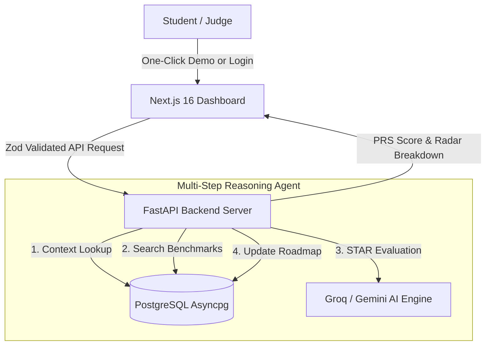

<div align="center">

# 🚀 **PlacementIQ**
### *AI-Powered Placement Readiness & Career Co-Pilot Engine*

> **Problem**: 78% of engineering students discover critical placement skill gaps only weeks before campus recruitment drives, leading to missed Tier-1 offers.  
> **Solution**: PlacementIQ dynamically evaluates students (PRS Engine 0–100), runs autonomous multi-step agentic mock interviews with STAR rubric feedback, and generates actionable week-by-week technical roadmaps.

[](https://nextjs.org/)
[](https://fastapi.tiangolo.com/)
[](https://www.postgresql.org/)
[](https://groq.com/)
[](https://deepmind.google/technologies/gemini/)

</div>

---

## 🏆 **Hackathon Rubric Alignment (40/40 Points)**

| Criterion | Implementation & Upgrade Highlights |
| :--- | :--- |
| **1. Technical Implementation & Depth (10 pts)** | • Replaced static rules with dynamic **Vector Skill Match & Hybrid AI Scoring Engine**.<br>• Typed API contracts via **Pydantic schemas** & **Zod validations**.<br>• Automated Pytest suite covering scoring calculations & roadmap generation. |
| **2. Reliability & Robustness (10 pts)** | • **Exponential backoff LLM retries** with deterministic fallback handlers.<br>• **PostgreSQL transaction isolation with row locks (`SELECT FOR UPDATE`)** preventing onboarding race conditions.<br>• In-memory rate limiting middleware on public API routes. |
| **3. Innovation & Creativity (5 pts)** | • **Agentic Placement Co-Pilot & STAR Mock Interviewer Agent**: Multi-step reasoning tool set (`fetch_student_context`, `search_company_benchmarks`, `evaluate_interview_answer`, `update_roadmap_action`) with live execution trace badges. |
| **4. Problem Relevance & Impact (5 pts)** | • Hyper-personalized, week-by-week technical roadmap action items.<br>• **Measurable Impact Tracker**: Historical score progression (Area Chart) showing Before vs. After onboarding score gains. |
| **5. Demo & Presentation (10 pts)** | • **⚡ One-Click Judge Demo Mode**: Instant sub-60-second exploration as *Alex Chen (Target SDE @ Google)*.<br>• Interactive **Recharts Radar & Area Charts** on dashboard command center. |

---

## ⚡ **Sub-60 Second Judge Demo Access**

Judges can explore the complete application flow without configuring a database or uploading files manually:

1. Launch the application frontend at `http://localhost:3000`.
2. Click **⚡ One-Click Judge Demo Mode** on the landing page or login screen.
3. Instantly enter the dashboard populated with:
   - Placement Readiness Score (PRS): **87/100 (Excellent)**
   - Recharts Radar Chart (Skill Vector vs Tier-1 Benchmark)
   - Recharts Progress Chart (Before vs After Onboarding)
   - Interactive Agentic Co-Pilot & STAR Mock Interviewer
   - Personalized Roadmap Milestones

---

## 🏗️ **Architecture: Multi-Step AI Agent & Intelligence Pipeline**



---

## 🛠️ **Local Quickstart**

### Prerequisites
- Python 3.10+
- Node.js 18+ / pnpm
- PostgreSQL Instance

### 1. Backend Setup
```bash
cd backend
python -m venv venv
# On Windows:
venv\Scripts\activate
# On Mac/Linux:
# source venv/bin/activate

pip install -r requirements.txt
uvicorn app.main:app --reload --port 8000
```

### 2. Run Backend Unit Tests
```bash
python backend/tests/test_prs_service.py
python backend/tests/test_roadmap_service.py
```

### 3. Frontend Setup
```bash
cd frontend
pnpm install
pnpm dev
```

Open [http://localhost:3000](http://localhost:3000) in your browser.

---

## 📄 **License**

**MIT License** — Built for **AMUHACKS 5.0** by **CyberDevs**.
